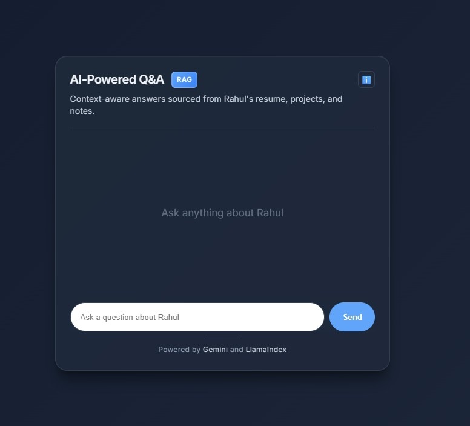
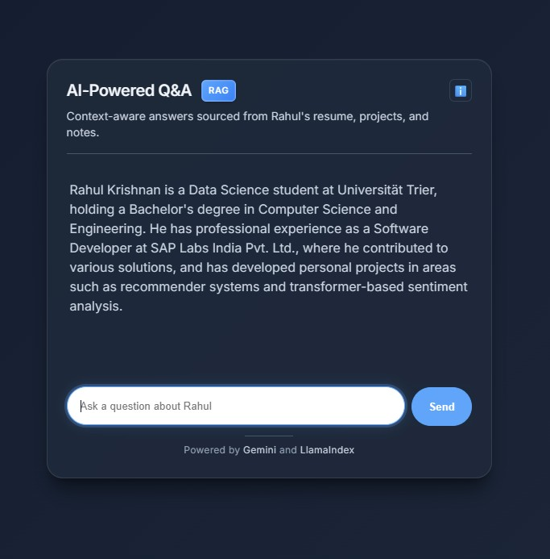

## RAG Resume API

### Live
Hosted and running at [rahul-krishnan.is-a.dev](https://rahul-krishnan.is-a.dev).

### Overview
Retrieval-Augmented Generation (RAG) API that indexes documents in `docs/` and answers questions using LlamaIndex with Google Gemini (embeddings + LLM). FastAPI provides `/health` and `/query` endpoints. Containerized with Docker and deployed as an API on GCP Free tier.

### Prerequisites
- **Python**: 3.12+
- **Environment**: `GOOGLE_API_KEY` set (in shell or `.env`)

### Quickstart
```bash
pip install -r requirements.txt
python build_index.py  # builds and persists index to ./index
python -m uvicorn app:app --host 0.0.0.0 --port 8000
```

### API
- **GET `/health`** → `{ "status": "ok", "model_loaded": boolean }`
- **POST `/query`**
  - Request body:
```json
{ "query": "Tell me about Rahul in 2 sentences.", "top_k": 5 }
```
  - Response body:
```json
{ "query": "...", "answer": "..." }
```

### Docker
```bash
# Build
docker build -t rag-resume-api .

# Run
docker run -e GOOGLE_API_KEY=YOUR_KEY -p 8000:8000 rag-resume-api
```

### Screenshots


